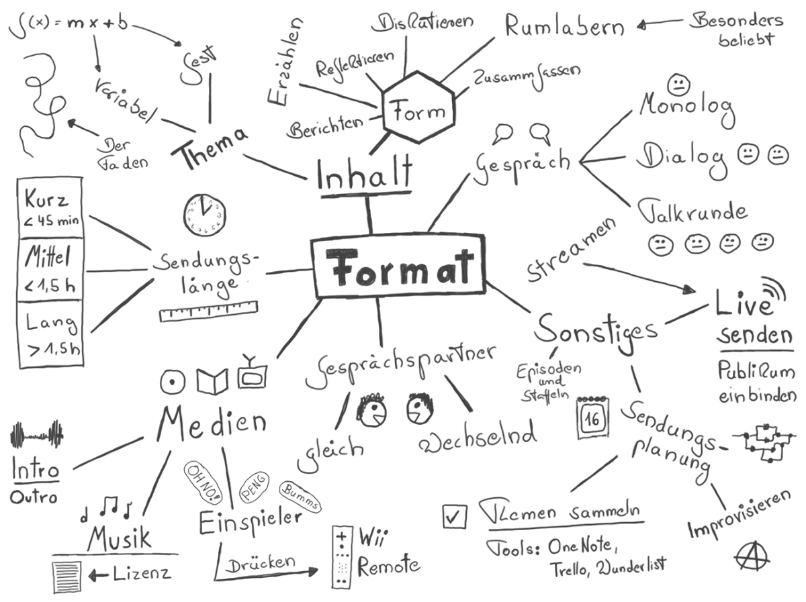

## Format

Das Format der Sendung ist die primäre Design-Entscheidung eines Podcasts. Wieviele Leute nehmen teil? Wer übernimmt die Rolle eines Moderators? Wie kann, soll und darf eine Sendung sein? Alle diese Parameter haben Einfluss auf die Technik und keine Technikkonstellation ist für jede Situation geeignet. Daher ist es sinnvoll, vor Beginn darüber nachzudenken, in welche Richtungen sich der Podcast entwickeln sollte und könnte. Im Folgenden eine Beschreibung typischer Podcast-Formate.

### Gesprächspartner: Monolog, Dialog oder Gesprächsrunde

Die Gesprächspartner im Podcast können über die Episoden (Sendungen) hinweg gleich bleiben oder wechseln. Je nach der Anzahl der Gesprächspartner unterscheidet man:

* **Monolog oder Solo-Podcast:** In einem Solo Podcast spricht nur eine Person. Das Hören monologischer Podcasts kann für den Zuhörer auch schnell anstrengend werden, da Pausen und Geschwindigkeitswechsel selten sind, die dem Hörer Verschnaufpausen und Abwechslung schaffen könnten. Solo-Podcasts lassen sich mit verhältnismäßig wenig Technikaufwand realisieren, da nur ein Mikrofon und keine Live-Schalte erforderlich sind. Für die Aufnahme kann eine einfache Software mit Aufnahmefunktion genommen werden (z.B. Audacity).
* **Dialog- oder Interview-Podcast:** Wird eine Sendung mit zwei Personen aufgenommen, ändert sich die Dynamik des Gesprächs in der Regel deutlich. Dabei ist es unerheblich, ob die beiden Personen gleichberechtigt als Moderatoren auftreten oder ob es sich um eine Moderator/Gast-Situation handelt. Die natürlichen Pausen eines wechselseitigen Gesprächs bzw. der Übergang zwischen zwei separaten Ansprachen schafft für den Hörer ein vom Solo-Podcast deutlich unterschiedliches Format. Um einen Dialog-Podcast aufzunehmen, sind die technischen Anforderungen etwas höher: es müssen zwei Stimmen in einer separaten Audio-Spur aufgenommen werden. Bei  
* **Talk- oder Gesprächsrunde:** Bei drei oder mehr Teilnehmern entwickelt sich ein Gespräch schnell zu einer sehe dynamischen Gesprächsrunde, die einerseits sehr unterhaltsam sein kann, es aber auch dem Zuhörer zunehmen schwerer macht, den einzelnen Sprechern zu folgen bzw. diese zu identifizieren (mehr als sechs Personen sind in Podcasts eher unüblich). Eine Möglichkeit, die Verständlichkeit einer großen Gesprächsrunde zu erhöhen, ist, jeden Sprecher im Stereobild an einer anderen Stelle zu positionieren (max. 20% rechts/links). 

### Sendungslänge

Die "richtige" Länge für Podcasts gibt es nicht, Podcasts können eine beliebige Länge haben, die dem Zweck des Podcasts angemessen ist. Oft wird die Dauer eines Inlandsflugs (30-45 Minuten) als optimale Länge genannt. Ganz grob kann man drei Kategorien von Podcast-Längen unterscheiden:

* **Kurze Podcasts** haben eine Länge von weniger als 45 Minuten
* **Mittellange** Podcasts sind zwischen 45 und 90 Minuten lang
* **Lange Podcasts** sind länger als 90 Minuten (bis zu mehren Stunden)

### Inhalt

Bei der inhaltlichen Gestaltung von Podcasts ist der Phantasie keine Grenze gesetzt. Jedes Thema, dass eine Gruppe von Personen interessiert, kann sich für einen Podcast eignen. Podcast-Episoden können ein Thema (monothematisch) oder mehrere Themen behandeln. Podcasts können sich außerdem mit aktuellen Themen (News-Podcasts) oder mit zeitlosen Themen (Evergreen) befassen. Eine gute Orientierung zu Themen von Podcasts gibt z.B. das Podcast-Verzeichnis von Apple:

* Kunst
* Wirtschaft
* Comedy
* Bildung
* Fiktion
* Regierung
* Gesundheit & Fitness
* Geschichte
* Kinder und Familie
* Freizeit
* Musik
* Nachrichten
* Religion und Spiritualität
* Wissenschaft
* Gesellschaft und Kultur
* Sport
* TV und Film
* Technologie
* Wahre Kriminalfälle

### Intro, Outro und Jingles

Ähnlich wie Radio- oder Fernsehsendung können auch Podcasts eine Musik am Anfang (Intro) und am Ende (Intro) haben, müssen sie aber nicht. Manche Podcasts nutzen das Intro auch, um einen Rückblick auf die vergangene Sendung zu machen (das "Previously") oder ein Zitat aus der aktuellen Episode anzuteasern.

Während einer Episode können im Podcasts sog. "Jingles" eingespielt werden. Das kann z.B. Werbung oder kurze Melodien sein. Hat ein Podcast verschiedene thematische Rubriken, können diese durch kurze Jingles voneinander getrennt werden.

Kostenfreie Töne und Musik gibt es z.B an folgenden Stellen (auf Lizenzen und Verwendungsrechte achten):

- [BBC Sound Effects](https://sound-effects.bbcrewind.co.uk)

- [Free Music Archive]([Free Music Archive - Welcome to the Free Music Archive](https://freemusicarchive.org/home))

- [YouTube](https://youtube.com), über die Suche, dann nach Creative Commons filtern, mit [youtube-dl](https://youtube-dl.org/) können Audios heruntergeladen werden