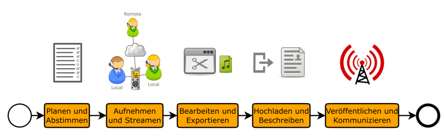

## Workflow

Die Produktion von Podcast-Episoden beginnt bereits vor der eigentlich Aufnahme, da man sich zunächst einmal darüber im Klaren sein sollte, was man eigentlich aufnehmen möchte, wie und mit wem:

Bevor man eine Podcast-Episode aufnimmt, sollte man sich über einige Parameter der Aufnahme Gedanken machen. Nicht alles, was hier aufgeführt wird muss zwingend so umgesetzt werden, aber es lohnt sich, zumindest zu prüfen, ob man vielleicht ohne nennenswerten Aufwand das eine oder andere von vornherein den Anforderungen an eine gute Aufnahme anpassen kann.

### Planen und Abstimmen

...

### Aufnehmen und Streamen

...

### Bearbeiten und Exportieren

...

### Hochladen und Beschreiben

...

### Veröffentlichen und Kommunizieren

...