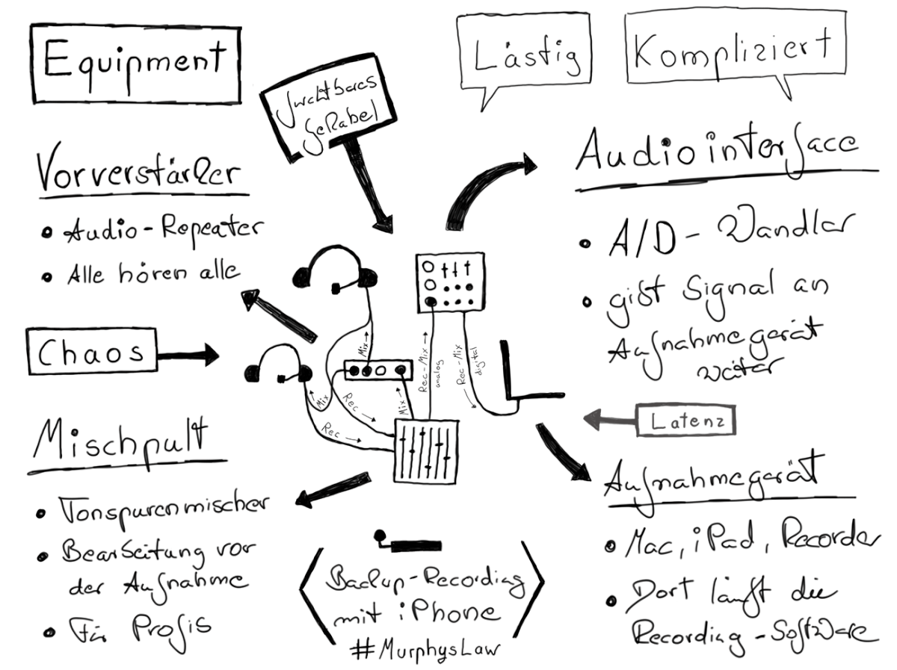

## Technik - Hardware

Die verwendete Ausrüstung sowie der Ort der Aufnahme einer Podcast-Episode kann sehr unterschiedlich sein. Von der mobilen Aufnahme mit dem Smartphone bis zum voll ausgestatteten Tonstudio sind alle Möglichkeiten denkbar. Für jede Aufnahmesituation müssen in der Planung die Rahmenbedingungen bedacht werden, die sich auf die Qualität der Aufnahme auswirken.

Diese Hardware-Optionen werden in Podcasting-Setups oft verwendet und in den folgenden Kapiteln beschrieben:

- **Mikrofone oder Headsets** (Hör-Sprechkombinationen) für eine gute Tonqualität

- **Audio-Rekorder**, um auch unterwegs oder im Besprechungsraum aufnehmen zu können

- **Audio-Interfaces und Mischpulte**, um guten Ton am Computer aufnehmen zu können und nicht von eingebauter Audio-Hardware (meist unbrauchbar) abhängig zu sein

- **Audio Processing Gerät** für Effekte wie Kompression, Expansion und Noise Gate (früher oft in Hardware gelöst, mittlerweil oft in Software)

**Tipp:** im Anhang dieses Leitfadens befindet sich eine Materialliste mit praxiserprobten Empfehlungen für Podcasting-Hardware.
