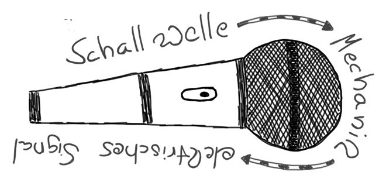

### Mikrofone und Headsets

Eine Aufnahme wird niemals besser als ihr schwächstes Glied zulässt und vor allem kann eine einmal gesenkte **Qualität in der Aufnahmekette** nicht mehr aufgewertet werden (bestenfalls “gerettet”). Daher ist es erforderlich, schon am Beginn der Aufnahmekette darauf zu achten, keinen nennenswerten Fehler zu machen. Die richtige Wahl des [Mikrofons](https://de.wikipedia.org/wiki/Mikrofon) ist dabei entscheidend, denn alles steht und fällt mit der **Wandlung von Schall zu einem elektrischen Signal**.

Hierbei können zwei Arten von Mikrofonen unterschieden werden:

* **Dynamische Mikrofone:** Ein [dynamisches Mikrofon](https://de.wikipedia.org/wiki/Dynamisches_Mikrofon) erzeugt das elektrische Signal, indem die Schallwellen auf eine Membran auftreffen, deren Bewegung dann auf eine Spule übertragen werden. Diese Spule umschließt einen Magneten der durch Induktion einen Stromfluss in dieser Spule erzeugt. Dieser Strom ist i.d.R. so klein, dass zusätzlich zum Mikrofon ein Mikronfverstärker verwendet werden muss.
* **Kondensatormikrofone:** [Kondensatormikrofone](https://de.wikipedia.org/wiki/Kondensatormikrofon) arbeiten nach dem Kondensatorprinzip: zwei sich in engem Abstand gegenüberstehende Metallplatten werden mit einer elektrischen Spannung geladen und erzeugen ein Magnetfeld. Auftreffende Schallwellen verändern den Abstand der beiden Platten und erzeugen einen entsprechenden Stromfluss. Gegenüber der Bewegung der Membran/Spule des dynamischen Mikrofons ist die Empfindlichkeit eines Kondensatormikrofons deutlich größer. Um zu funktionieren brauchen Kondensatormikrofon eine Speisespannung, auch Phantomspannung genannt (z.B. 12V, 48V).

Außerdem ist darauf zu achten, dass Mikrofone unterschiedliche **Aufnahmecharakteristiken** haben. Das bedeutet, dass sie Schallwellen, die aus unterschiedlichen Richtungen kommen, unterschiedlich laut aufnehmen. Oft eingesetzte Mikrofoncharakteristiken sind:

- **Kugel:** Schallwellen aus allen Richtungen (360 Grad) werden gleich laut aufgenommen.
- **Niere:** das Mikrofon hat eine Vorzugsrichtung, aus der Schallwellen besonders laut aufgenommen werden, alle anderen Richtungen sind nur gedämpft zu hören (gut z.B. in lauteren Räumen).
- **Superniere:** wie Niere, nur, dass die Richtfunktion noch stärker ist.

Mikrofone werden meist als **Tischmikrofon** auf einen Tisch gestellt oder an einem Stativ montiert. Eine besondere Bauform ist das **Headset** (z.B. Beyerdynamic DT297), bei dem Mikrofon und Kopfhörer zusammen ausgeführt sind. Das hat gerade bei ungeübten Podcastenden den Vorteil, dass sich das Mikrofon unabhängig von der Kopfbewegung immer an der gleichen Stelle befindet. Es ist darauf zu achten, dass das Mikrofon sich nicht im Strom der Atemluft befindet (z.B. vier Finger vom Mund weg und seitlich auf Nasenhöhe).

**Tipp:** der Ton einer Aufzeichnung sollte bei Podcasts wie bei Videokonferenzen nie im gleichen Raum zu hören sein, in dem das Mikrofon steht, da es sonst zu Rückkopplungen kommen kann. Deswegen sollte immer ein Kopfhörer oder ein Headset verwendet werden.

**Tipp:** die Freisprecheinrichtung eines mobilen Telefons (z.B. iPhone) bietet oftmals erstaunlich gute Tonqualität (z.B. Earpod mit Klinken- oder Lightning-Anschluss). Man muss allerdings darauf achten, dass die im Kabel eingebaute Mikrofonkapsel nicht an Kleidung, Schal oder Haaren reibt.

Häufig verwendete Headsets und Mikrofone sind:

- [Beyerdynamic DT297](https://www.beyerdynamic.de/p/dt-297)
- [V-Moda Boom Pro](https://www.v-moda.com/us/de/products/boompro-microphone) (s.a. [Beitrag im Sendegate](https://sendegate.de/t/headsets-fuer-podcasting-und-videokonferenzen-corona-edition/12714))
- [Rode NT USB](https://rode.com/de/microphones/usb/nt-usb)
- Sure [SMB7](https://www.shure.com/de-DE/produkte/mikrofone/sm7b?variant=SM7B) oder [MV7](https://www.shure.com/de-DE/produkte/mikrofone/mv7d?variant=MV7-K) (Variante mit USB)
