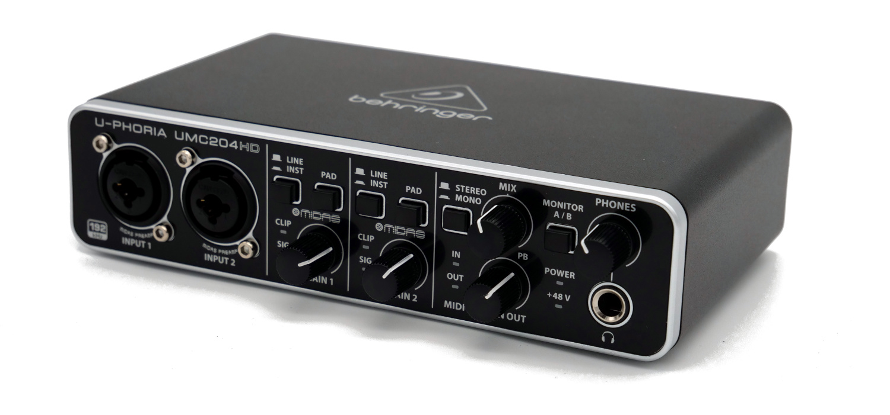

### Audio-Interfaces und Mischpulte

Ein [Audio-Interface](https://de.wikipedia.org/wiki/Audio-Interface) kann als Alternative zum Audio-Rekorder verwendet werden, um Audio digital direkt im Computer aufzeichnen zu können. Es bildet die Schnittstelle zwischen Audio-Quellen wie z.B. Instrumente, Mikrofone und dem Computer. Das Audio-Interface verstärkt Audio-Signale und wandelt die analogen Signale in digitale um. Der Anschluss an den Computer erfolgt z.B. über die USB-Schnittstelle (z.B. Behringer U-Phoria UMC204HD, Focusrite Scarlett 2i2).

Ein [Mischpult](https://de.wikipedia.org/wiki/Mischpult) ist noch flexibler, als ein Audio-Interface. Es bietet meist eine Vielzahl von Eingangskanälen. Das Audiosignal läuft durch den sog. Kanalzug (en: Channel Strip), im Mischpult von oben nach unten). Jeder Kanalzug repräsentiert den Verlauf eines Eingangssignals.

Manche Kanalzüge enthalten Mikrofoneingänge mit Vorverstärkern, häufig auch mit 48V-Phantomspeisung. Im weiteren Verlauf kann auf jedem Kanalzug das Eingangssignal per Equalizer in seinem Klangbild beeinflusst und die Verteilung des Signals auf die beiden Stereokanäle des “Main Mix” eingestellt werden (englisch “Panning”). Ein Hauptregler steuert schlicht die Lautstärke des Eingangssignals im Ausgang des Mischpults (meist Main Mix genannt).

Mischpulte können rein analog ausgeführt sein (Ausgang ist ein analoges Signal) oder über ein integriertes Audio-Interface direkt an einem Computer zu verwenden sein (z.B. Yamaha AG Reihe, Zoom L12).

Die meisten Mischpulte sind für die Produktion von Musik gedacht. Es gibt aber auch Mischpulte, die speziell auf Podcasting-Bedürfnisse ausgerichtet sind (z.B. Rode Rodecaster Pro) und z.B. folgende Funktionen bieten:

- Eingebautes Soundboard für Einspieler, Jingles, Bumper etc.

- Eingebaute N-1-Schaltung für Remote-Podcasting oder um an Videokonferenzen teilzunehmen

- Klinke- (TRRS) oder Bluetooth-Konnektivität, z.B. um Smartphones anzuschließen

- Eingebaute Kopfhörerverstärker

- Eingebaute Effekte wie Noise Gate, Kompressor und Expander

- Funktion zum Setzen von Schnitt- und Kapitelmarken

Focusrite

Behringer
