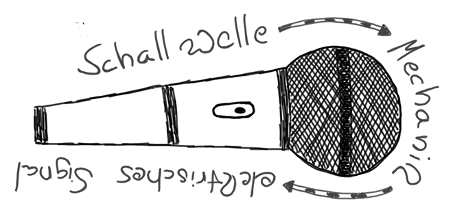

## Hardware

Der Ort der Aufnahme einer Podcast-Episode kann sehr unterschiedlich sein. Von der mobilen Aufnahme mit dem Smartphone bis zum voll ausgestatteten Tonstudio sind alle Schattierung denkbar. Für jede Aufnahmesituation müssen in der Planung die Rahmenbedingungen bedacht werden, die sich auf die Qualität der Aufnahme auswirken.

### Mikrofone und Headsets
Eine Aufnahme wird niemals besser als ihr schwächstes Glied zulässt und vor allem kann eine einmal gesenkte Qualität in der Aufnahmekette nicht mehr aufgewertet werden (bestenfalls “gerettet”). Daher ist es erforderlich, schon am Beginn der Aufnahmekette darauf zu achten, keinen nennenswerten Fehler zu machen. Die richtige Wahl des Mikrofons ist dabei entscheidend, denn alles steht und fällt mit der Wandlung von Schall zu einem elektrischen Signal. Im Kern müssen zwei Arten von Mikrofonen unterschieden werden. Dynamische Mikrofone und Kondensator-Mikrofone. Beide sind für unterschiedliche Zwecke gedacht und geeignet und beide kommen für die Podcast-Produktion in Frage.

* **Dynamische Mikrofone:** Ein dynamisches Mikrofon erzeugt das elektrische Signal, indem die Schallwellen auf eine Membran auftreffen, deren Bewegung dann auf eine Spule übertragen werden. Diese Spule umschließt einen Magneten der durch Induktion einen Stromfluss in dieser Spule erzeugt. Dieser Stromfluss kann dann als Audiosignal weiter verarbeitet werden. Dynamische Mikrofone erfordern einen relativ hohen Schalldruck, was sich daran äußert, dass ihre Signale mit abnehmendem Abstand der Geräuschquelle (z. B. dem Sprecher) zum Mikrofon stark abnehmen. Nur eine nahe am Mikrofon befindliche Schallquelle wird vom Mikrofon gewandelt, leisere Quellen reißen schnell ab und werden nicht berücksichtigt. Damit ist ein dynamisches Mikrofon sehr unempfindlich gegen (auch laute) Hintergrundgeräusche. Der Vorteil ist aber auch ein Nachteil: ein dynamisches Mikrofon zwingt den Sprecher, den Abstand zum Mikrofon möglichst gering zu halten, was eine gewisse Erfahrung und Disziplin beim Sprechen erfordert. Für eine stationäre Aufnahme sind dynamische Mikrofone meist nicht die erste Wahl. Man kann diesen Nachteil etwas abmildern, wenn man sich für extrem hochwertige und damit auch sehr teure Mikrofone entscheidet, die qualitativ mit Kondensatormikrofonen mithalten können.
* **Kondensatormikrofone:** Kondensatormikrofone arbeiten – wie der Name schon sagt – nach dem Kondensatorprinzip. Zwei sich in engem Abstand gegenüberstehende Metallplatten werden mit einer elektrischen Spannung geladen und erzeugen ein Magnetfeld. Auftreffende Schallwellen verändern den Abstand der beiden Platten und erzeugen einen entsprechenden Stromfluss. Gegenüber der Bewegung der Membran/Spule des dynamischen Mikrofons ist die Empfindlichkeit eines Kondensatormikrofons deutlich größer. Ein Kondensatormikrofon kommt daher dem Podcaster im Prinzip sehr entgegen und auch im professionellen Radio kommen selten andere Mikrofone zum Einsatz. Die Qualität ist bei gleichem Preis deutlich höher, Stimmen werden viel realistische abgebildet und auch kleinste Nuancen werden registriert. Für die Vorladung des Kondensators benötigen Kondensatormikrofone eine anliegende Spannung, die sogenannte Phantomspannung (oder auch Phantomspeisung). Diese liegt in der Regel bei 48V und wird von vielen Mikrofoneingängen mitgeliefert. Dies gilt es aber stets zu prüfen, nicht jeder Mikrofoneingang liefert Phantomspannung bzw. manchmal muss diese noch explizit ein- oder zugeschaltet werden. Auch hier ist der Vorteil ein Nachteil. Zwar sind bei dem empfindlichen Kondensatormikrofon dank der ungeheuren Empfindlichkeit Lautstärke und Nähe zum Mikrofon nicht mehr ganz so entscheidend, wie beim dynamischen Mikrofon, doch bedeutet dies auch, dass unerwünschte Hintergrundgeräusche viel eher mit auf der Aufnahme landen. Ein daraus resultierendes Problem kann das sogenannte Übersprechen sein: bei einer Aufnahme mit mehreren Mikrofonen kann eine laute Stimme von einem weiteren, ggf. zu empfindlich eingestellten Mikrofon mit aufgenommen werden. Dieses Übersprechen erzeugt schnell unerwünschte Halleffekte, auf die mit besserer Schalldämmung oder niedrigeren Eingangspegeln reagiert werden sollte.

**Mikrofoncharakteristik:** Jedes Mikrofon hat eine bestimmte Charakteristik, die bezeichnet, in welchem Bereich um das Mikrofon das Mikrofon besonders sensitiv ist. Üblicherweise unterscheidet man grob zwischen einer “Niere”, einer nierenförmigen Ausprägung des Aufnahmebereichs und einer “Kugel”, einem 360-Grad-Aufnahmbereich.

Die “Niere” ist aber nicht immer gleich. Man unterscheidet im Detail zwischen einfachen und sog. “Supernieren” und meint damit die konkrete Ausdehnung des Aufnahmebereichs, der mehr oder weniger eng gefasst sein kann. Richtmikrofone sind z.B. Mikrofone in denen die Niere so schmal gefasst ist, dass der Aufnahmebereich nur im unmittelbaren Frontbereich des Mikrofons gilt. Damit können Störgeräusche von der Seite umgangen werden, erfordern aber auch eine präzise Ausrichtung des Mikrofons.

**Headsets:** Kopfhörer sind für das Podcasting ein wichtiges Instrument und das nicht nur zum Abhören von Aufzeichnungen. Grundsätzlich empfehlen sich Kopfhörer schon für die Aufnahme von Podcasts, um die Qualität des erzeugten Tonsignals in Echtzeit zu überprüfen. Sind alle Teilnehmer einer Sendung mit Kopfhörern ausgestattet, vereinfacht dies auch die Kommunikation im Gespräch. Nebengeräusche können leichter ausgeblendet werden und man erhält zusätzlich noch die Möglichkeit, über das Mischpult zusätzliche Tonsignale einzuspielen (z.B. weitere Gesprächsteilnehmer über Telefon oder beliebiges aufgezeichnetes Audiomaterial, Hintergrundmusik). Allein schon aus atmosphärischen Gründen kann zu der Verwendung von Kopfhörern nur geraten werden, auch wenn dies die Initialkosten erhöht. Besonders interessant für Podcaster sind sogenannte "Hörsprech-Garnituren", im Volksmund auch Headsets genannt. Diese kombinieren Kopfhörer und Mikrofon. Da hier beide Komponenten qualitativ hochwertig sein sollten und der Tragekomfort stimmen muss, ist die Auswahl entsprechend niedrig. Headsets bieten einen weiteren Vorteil: dadurch, dass das Mikrofon direkt am Kopf befestigt ist, verändert sich der Abstand zur Mikrofonkapsel durch Kopf- und Körperbewegungen nicht. Ein einmal richtig eingestellter Mikrofonhals sollte dauerthaft konstante Ergebnisse liefern. Dies ist vor allem für mit dem Umgang mit Mikrofonen unerfahrene Gäste einer Sendung hilfreich. Eine gute Option sind z.B. die Beyerdynamic DT297 Modellserie, die gute Kopfhörer und für ihre Größe hervorragende Kondensatormikrofone kombinieren. Das Anschlusskabel ist zudem nicht fest verbunden, sondern kann über einen Stecker dem jeweiligen Längen- und Steckerbedarf angepasst werden. Beim Einsatz von Kopfhörern und Headsets kommt ein Aspekt ins Spiel, der von Einsteigern häufig übersehen wird: es ist wichtig, dass das Audiosetup den Main Mix möglichst verzögerungsfrei an die Kopfhörer liefert. Entstehen durch den Aufbau große Latenzen von mehreren Millisekunden, wird der Sprecher durch sein eigenes Audiosignal verwirrt. Dies gilt es zu verhindern. In einem rein analogen Setup, wo der Kopfhörer-Mix durch ein Mischpult erzeugt wird, sind Latenzen in der Regel kein Problem, da der Signallauf in Lichtgeschwindigkeit erzeugt wird. Werden allerdings Mikrofone per USB oder andere digitale Schnittstellen über einen Computer geleitet und der Kopfhörer-Mix zunächst durch eine Kaskade von Software und Modulen geleitet kann es zu erheblichen Verzögerungen kommen, die sich störend auswirken. Diese Hörlatenz ist auf jeden Fall zu vermeiden.

**Mikrofonvorverstärker:** Das Ausgangssignal eines Kondensatormikrofons ist deutlich niedriger als das eines dynamischen Mikrofons. Es muss daher am Mikrofoneingang zusätzlich verstärkt werden - der sogenannte Mikrofon-Vorverstärker. Qualitativ minderwertige Vorverstärker können dabei auch das beste Kondensatormikrofon nutzlos machen, da sie zu viel Rauschen hinzufügen oder einfach nur unsauber verstärken und das Signal verzerren. Bei der Wahl eines Mischpultes sollte daher nicht nur auf die reine Mischfunktionalität oder vorhandene Ein- und Ausgänge geachtet werden - auch die Qualität der Mikrofoneingänge sollte geprüft werden. Für einfache Anforderungen sollten die meisten Mischpulte ausreichen, aber es prüfe wer sich ewig bindet. Neben Mikrofoneingängen in Mischpulten und Rekordern gibt es auch reine Mikrofonvorverstärker, die sich ausschließlich auf die Aufbereitung der Mikrofonsignale konzentrieren. Diese sind aber für einfache Podcast-Setups eher nicht erforderlich, es sei denn, man benötigt eine große Anzahl von separaten Eingängen, die einem ein Mischpult oder Audiointerface nicht bietet.

### Audio-Rekorder
Der Markt bietet eine Vielzahl an möglichen Rekordern, mit denen man Gespräche aufzeichnen kann. Das geht von einfachen portablen Rekordern mit eingebauten Mikrofonen, die man gut für Ad-Hoc-Aufnahmen unterwegs einsetzen kann bis zu speziellen, mehrkanaligen Geräten, die Phantomspeisung für Kondensatormikrofone bieten.

Wenn man ein Mischpult einsezt benötigt man für eine einfache Aufnahme nur einen Rekorder mit einem Stereoeingang. Alternativ kann man hier auch einen tragbaren Computer verwenden, doch sollte man tunlichst vermeiden, eingebaute analoge Audioeingänge zu verwenden, da diese in Laptops in der Regel zu starken Störstrahlungen ausgesetzt sind und extrem minderwertige Signale aufzeichnen. Möchte man einen Computer einsetzen empfiehlt sich der Einsatz eines Mischpultes mit USB oder FireWire Interface, das man mit dem Computer verbinden kann.

Eine weitere interessante Entwicklung sind Geräte, die ein Hybrid aus mobilen Mischpulten und Aufnahmegeräten darstellen. Sie erlauben den Anschluß von Mikrofonen, das Erstellen eines Main Mix und eine Mehrspur- Aufzeichnung in einem Gerät bei zunehmend preislich attraktiven Preisen.

Das Zoom R24 kombiniert alle für das Podcasting wichtigen Funktionen in einem Gerät. Das erleichert auch den Transport und kurzfristigen Einsatz und erlaubt mobilere Formate ohne auf Aufnahmekomfort verzichten zu müssen.

Allerdings gibt es bei solch stark integrierten Geräten auch immer Einschränkungen gegen über aus Komponenten zusammengesetzten Setups. Dies sollte bei der Planung berücktsichtigt werden.

So ist ein Stereoausgang nicht genug für flexible Mixer-Setups, bei dem z.B. einem Gesprächsteilnehmer, der über Telefon zugeschaltet ist, ein eigener Audiomix geliefert werden muss, der seine eigene Stimme nicht enthält (der sogenannte "N-Minus-Eins-Mix"). Für normale Gesprächsrunden kommt man damit aber schon sehr weit.

### Audio-Interfaces

Ein [Audio-Interface](https://de.wikipedia.org/wiki/Audio-Interface) ist ein wichtiges Bestandteil eines modernen Tonstudios. Es bildet die Schnittstelle zwischen Audio-Quellen wie z.B. Instrumente, Mikrofone und dem Computer. Das Audio-Interface wandelt analoge in digitale Audio-Signale um. Der Anschluss an den Computer erfolgt z.B. über die USB-Schnittstelle.

### Mischpulte

Ein Mischpult ist nicht immer erforderlich, empfiehlt sich aber in den meisten stationären Aufnahmesituationen, da es die Signalwege vereinheitlicht und flexibel macht. Ein Mischpult erlaubt aber vor allem das Erzeugen eines “Mix” beim Einsatz von mehr als einem Mikrofon.

Mischpulte gibt es in allen Größen, Ausbaustufen und Preisklassen, doch folgen sie alle ähnlichen Konzepten. Im Mittelpunkt steht die parallele Anordnung mehrerer “Kanalzüge” (englisch “Channel Strips”). Jeder Kanalzug repräsentiert den Verlauf eines Eingangssignals. Manche Kanalzüge enthalten Mikrofoneingänge mit Vorverstärkern, häufig auch mit 48V-Phantomspeisung. Im weiteren Verlauf kann auf jedem Kanalzug das Eingangssignal per Equalizer in seinem Klangbild beeinflusst und die Verteilung des Signals auf die beiden Stereokanäle des “Main Mix” eingestellt werden (englisch “Panning”). Ein Hauptregler steuert schlicht die Lautstärke des Eingangssignals im Main Mix.

Größere Mischpulte bieten darüberhinaus die Möglichkeit, das Signal auch noch in einen separaten Stereomix einzublenden (den sogenannten AUX-Mix). Dieses Feature kann für Podcaster in Live-Situationen und bei der Einbindung von Telefonanrufern (z.B. über ISDN oder IP-Telefonie) sinnvoll und notwendig sein.

Einfache Mischpulte sind analog aufgebaut, alle Signalwege sind elektrisch gekoppelt. Moderne, teurere Mischpulte arbeiten zunehmend auf digitaler Basis und bilden die Signalwege als Informationsfluss ab. Digitale Systeme sind in der Regel flexibler in der Verschaltung von Ein- und Ausgängen und weisen klassische Probleme analoger Mischpulte wie das Übersprechen von Kanälen durch mangelnde Signaltrennung prinzipbedingt nicht mehr auf.

Für Podcaster zunehmend interessant sind Mischpulte, die ihren Main Mix (und häufig zusätzlich auch die Eingangsignale und AUX-Mixe) per USB- und/oder FireWire-Schnittstellen direkt einem Computer zugänglich machen. Dem Computer gegenüber stellt sich das Mischpult als mehrkanaliger Audioein- und ausgang dar. Dies erlaubt die einfache Aufnahme auf dem Computer, sowie das Einspielen von Audiomaterial direkt vom Computer in den Main Mix per Software ohne den Umweg eines analogen Audiosignals. Viele Einstiegsmodelle (wie z.B. von Phonic oder Behringer) bieten schon solche Schnittstellen, die auch ohne zusätzliche Treiber “out of the box” funktionieren.

### Audio Processing

* **Effektgeräte:** Unter dem Begriff "Effektgeräte" versteht man eine nahezu endlose Typenvielfalt von Geräten, mit denen man das eingehende Tonsignal auf dem Weg zum Mischpult verändern kann. Die meisten Geräte machen allerdings nur in der Musikproduktion wirklich sinn. Allerdings können manche Geräte auch die Klangqualität für Podcasts merklich beeinflussen und sollten bei aufwändigeren Produktionen zumindest erwogen werden.
* **Kompressoren:** Die Kompression ist die wichtigste Signalverarbeitung im Radiobereich. Jeder kennt den Effekt vom normalen Radio hören: ob man "lauter" Musik oder einem ruhig redenden Nachrichtensprecher lauscht, nur selten sieht man sich genötigt, den Lautstärkeregler des Empfangsgerätes zu bedienen, weil sich im Kern immer das selbe Lautstärkeempfinden einstellt. Dies ist ein beabsichtigter Effekt und wird durch eine aufwändige Kompression erreicht. Als Kompression bezeichnet man konkret das Verändern des Audiosignals in einer Weise, so dass besonders laute Passagen in ihrer Lautstärke abgesenkt werden, während leisere Passagen weniger oder gar nicht verändert werden. Dies führt dazu, dass laute und leisere Passagen danach "näher" beinander liegen. Man spricht davon, dass die "Dynamik" des Signals erhöht wurde. Kompressoren müssen mit bestimmten Parametern gesteuert werden: ein Schwellwert (engl. Threshold) bestimmt, ab welcher Lautstärke die Kompression einsetzt und ein ein Kompressionsverhältnis (engl. Compression Ratio) bestimmt, in welchem Größenordnung die Kompression angesetzt wird. Zusätzlich kann der Übergang am Schwellwert weicher eingestellt werden (engl. Soft Knee) und meist übernimmt der Kompressor auch die Nachverstärkung des in seiner Lautstärke reduzierten Signals gleich mit, um den Lautstärkeverlust auszugleichen. Nicht selten finden sich noch zusätzliche Limiter, die das Signal nachträglich bei einer bestimmten Maximallautstärke hart begrenzen. Im Ergebnis hat man ein insgesamt lauter klingendes Signal, das die Unterschiede zwischen lauten und leisen Passagen reduziert. Die Kompression ist besonders für Podcasts wertvoll, da Podcasts häufig unterwegs und nicht selten in lauten Umgebungen gehört werden. Da ist es besonders wichtig, dass man die maximale Lautstärke des Abspielgeräts gut nutzt und ein sorgfältig komprimiertes Signal hält die gesamte Aufnahme auf einer hohen Gesamtlautstärke, so dass auch bei vielen Störgeräuschen der Inhalt immer noch deutlich wahrgenommen werden kann.

* **Expander:** Der Expander ist der kleine Bruder der Kompression und ist besonders bei der Aufnahme mit mehreren Mikrofonen oder wenn die Aufnahme unter Bedingungen mit störenden Hintergrundgeräuschen durchgeführt wird, hilfreich. Ein Expander geht ähnlich vor wie ein Kompressor, allerdings werden hier leise Passagen noch leiser gemacht, während lautere Passagen weniger oder gar nicht verändert werden. Der Expander sorgt also dafür, dass in Gesprächspausen leise, aber für die Aufnahme nicht relevante Klangquellen, automatisch ausgeblendet werden. Bei Aufnahmen mit mehreren Mikrofonen kann der Expander das "Übersprechen" von einem auf ein anderes Mikrofon einschränken bzw. unterbinden. Damit erzielt man bei einer Mehrspuraufnahme besser voneinander getrennte Signale, was die Nachbearbeitung vereinfacht und auch potentielle Halleffekte aus der Aufnahme herausnimmt. Die Parametrisierung ist auch ähnlich zur Kompression. Wieder bestimmt ein Auslösewert (engl. Threshold) bis zu welcher Lautstärke der Expander aktiv werden soll und