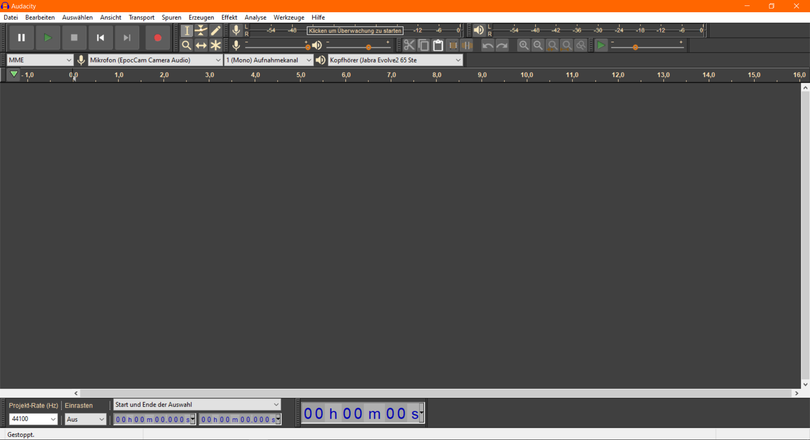

### Audacity

[Audacity](https://www.audacityteam.org) ist eine freie und damit kostenlose Softwarelösung für einfache Aufnahme und Audiobearbeitung. Sie bietet im Kern alles, was man für den Einstieg braucht. Audacity unterstützt allerdings keine Mehrspur-Aufnahmen.

**Vorteile:**

* Für Einsteiger_innen leicht zu lernen
* Verfügbar für Windows, Mac und Linux
* Kostenlos (Open Source)
* Portable Version verfügbar (keine Installation notwendig)
* Effekte wie Normalisierung, Lautheit-Normalisierung, Kompressor, Equalizer etc. vorhanden

**Nachteile:**

* Podcast-Funktionalität wie z.B. Unterstützung für Remote-Podcasting, Livestreaming fehlt

**Links:**

- [Dokumentation und FAQ](https://support.audacityteam.org/)
- [Audacity Reference Manual](https://manual.audacityteam.org/)
- [Audacity Forum](https://forum.audacityteam.org/)
- Youtube-Kanal [Audacity](https://www.youtube.com/@audacity)
- [Audacity](https://wiki.cogneon.de/Audacity) in COPEDIA
- [Audacity Portable](https://portableapps.com/de/apps/music_video/audacity_portable) (portable Version, die man ohne Installationsrechte oder auf einem USB-Stick nutzen kann)
