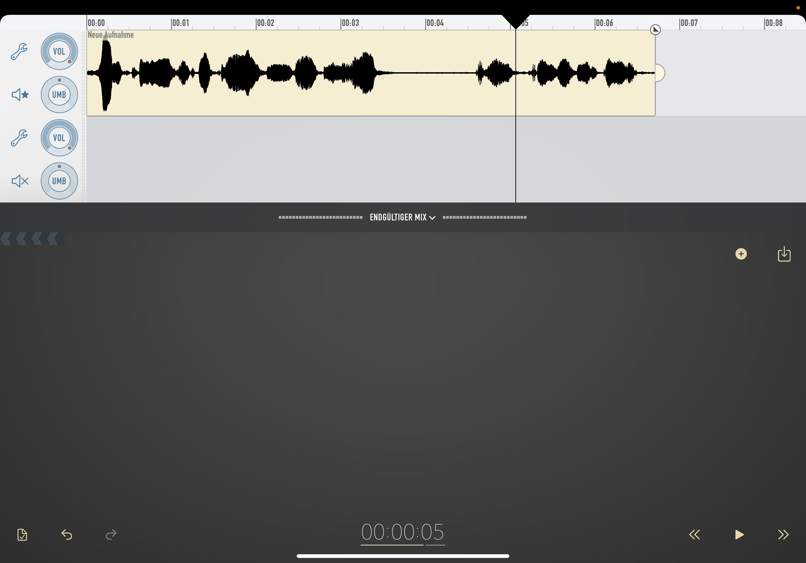

### Ferrite

[Ferrite](https://www.wooji-juice.com/products/ferrite) ist eine iOS App zum Aufnehmen und Bearbeiten (Multitrack) von Audio. Kleinere Audio-Projekte können damit z.B. auf dem iPad mobil aufgezeichnet, geschnitten und veröffentlicht werden.

 

**Vorteile:**

* Vollständige Produktion auf einem mobilen Endgerät (z.B. Tablet) möglich
* Kostenkünstig (kostenfreie Basisversion verfügbar)

**Nachteile:**

* Komplexe Audio-Projekte sind auf mobilen Endgeräten umständlich zu bearbeiten
* Es ist schwieriger, Audio-Hardware (z.B. Audio-Interface) an mobilen Endgeräten zu betreiben