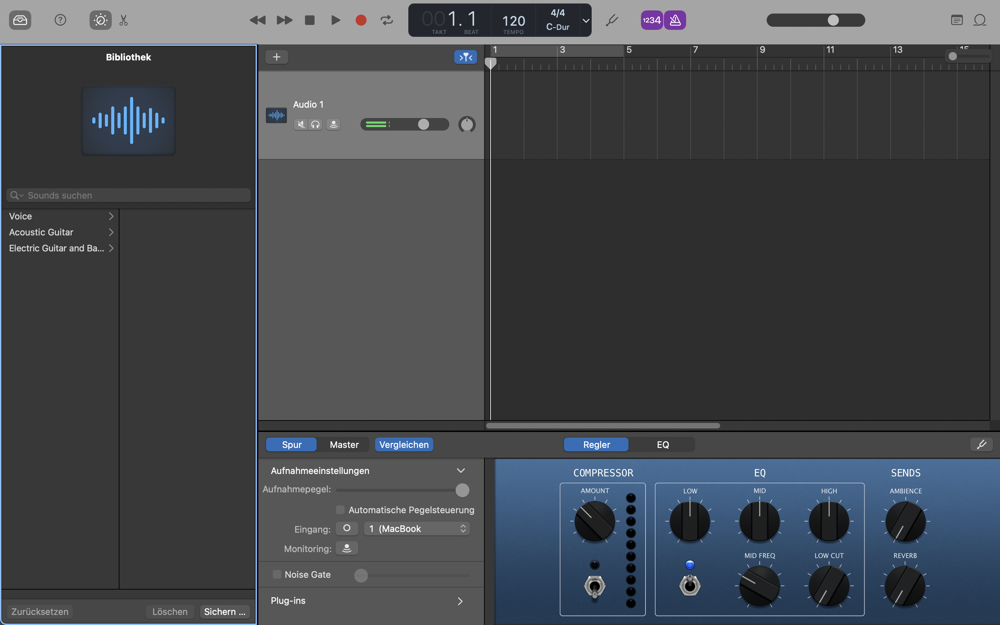

### Garageband

[Garageband](https://www.apple.com/mac/garageband) ist eine Software von Apple für die Aufnahme und Bearbeitung von Musik und Podcasts. Es ist sehr einfach zu bedienen und hat viele Funktionen, die gerade die Podcastaufnahme - und publikation unterstützen. So kann man in Garageband einfach auch Kapitelmarken hinzufügen. Garageband läuft nur unter Mac OS X.

**Vorteile:**

* Sehr einfach zu bedienen
* Kostenlos

**Nachteile:**

* Nur für Mac und iPad verfügbar
* Wenig Podcasting-Funktionen (z.B. Remote-Podcasting, Livestreaming)