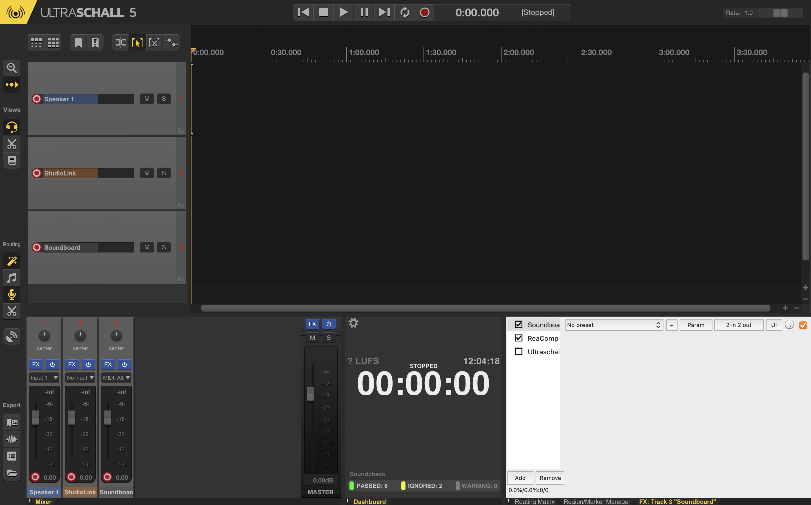

### Reaper + Ultraschall

[Reaper](https://www.reaper.fm) ist eine Anwendung für Audio Produktion mit Mehrspuraufnahme, Midi Aufnahme und Werkzeugen für Bearbeitung, Mixen und Mastering von Musik. Das Projekt [Ultraschall](https://ultraschall.fm) optimierte Reaper für die Aufnahme und Produktion von Podcasts.

**Vorteile:**

* Reaper ist günstig, Ultraschall kostenlos
* Sehr vollständiger Funktionsumfang für das Podcasting (z.B. Remote-Podcasting, Livestreaming, Levelling, Kapitelmarken, Livestreaming)
* Für Windows und Mac verfügbar

**Nachteile:**

* Komplexer Installationsprozess, da erst Reaper und dann Ultraschall als Erweiterung installiert werden muss
* Im Vergleich zu Software wie Audacity höherer Einarbeitungsaufwand

**Links:**

* [Ultraschall Handbuch](https://ultraschall.github.io/ultraschall-manual/docs/introduction) (auch [auf Englisch](https://ultraschall.github.io/ultraschall-manual/en/docs/introduction/) verfügbar)
* [Ultraschall Tutorial](https://docs.leonidlezner.de/ultraschall-tutorial) von Leonid Lezner
* [Ultraschall Video-Tutorials](https://www.youtube.com/watch?v=LeDNF-GWdxI&list=PLt-IZcwZ3VJk0gBVOz-BNRTxFp8-eNAFN) von Joram
* c't Artikel [Von null auf Sendung](https://www.heise.de/select/ct/2020/14/2014915163287581935) (Ultraschall 4)
