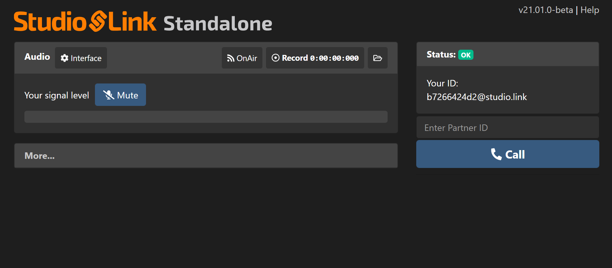

### Studio Link Standalone

[Studio Link](https://studio-link.de) ermöglicht hochwertige Audioverbindungen über das Internet, z.B. zum schnellen und einfachen Einbinden von Gästen. Durch die Verwendung des Audioformats [Opus](https://de.wikipedia.org/wiki/Opus_(Audioformat)) sind die Verbindungen mit Studio Link i.d.R. von hoher Qualität und niedriger Latenz.

**Tipp:** da Studio Link auch lokal aufnehmen kann, kann es auch ohne weitere Software für die Aufzeichnung von Mehrspur-Aufnahmen verwendet werden.

**Vorteile:**

* Einfach Möglichkeit für die Aufnahme von Remote-Podcasts
* Kostenfrei
* Für Windows, Mac und Linux verfügbar
* Lokale Aufzeichnung möglich (gut bei schlechter Internet-Verbindung)

**Nachteile:**

* Kein Einfluss auf Aufnahmeparameter (Hinweis: Seit Version v21.07.0 lässt sich die Lautstärke einstellen. Allerdings sollte das nur benutzt werden wenn es keine andere Möglichkeit der lokalen Gain-Anpassung gibt.)
