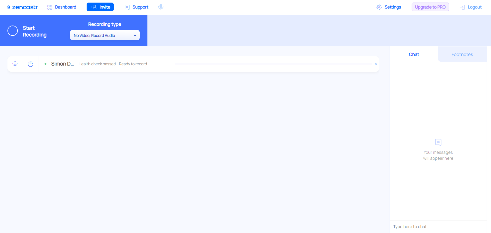

### Zencastr

[Zencastr](https://zencastr.com/) ist eine Podcast-Aufnahme-Software, die vollständig im Browser läuft (keine Installation notwendig). Es gibt eine kostenfreie und eine kostenpflichtige Version. Neben Audio-Spuren ist auch eine Übertragung von Video (z.B. Webcam möglich).

**Vorteile:**

* Komplett webbasiert, keine Installation von Software notwendig
* Einfach zu bedienen

**Nachteile:**

* Wenig Konfigurationsmöglichkeiten
