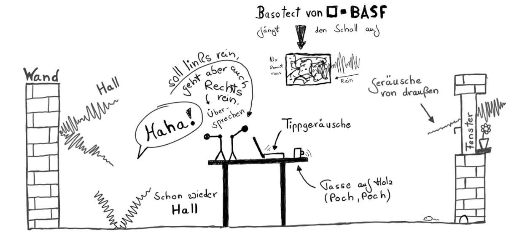

## Studio
Auch wenn man als Podcaster:in meist kein professionelles [Tonstudio](https://de.wikipedia.org/wiki/Tonstudio) verwendet, gibt es doch einige Rahmenbedingungen zu beachten, um eine **gute Audioqualität** zu erhalten.

### Raumsituation und Hall

Wenn man innerhalb eines Raumes aufnimmt, sollte man sich einen Raum suchen, der nicht so viel Hall entwickelt. **Kahle Wände** und **glatte Fensterfronten** sind die Hauptursache für Hall, der sich nachher störend auf die Aufnahme legt und es den Zuhörern unnötig schwer macht, dem Gespräch zu folgen.

Es ist nicht immer einfach, vorhandenen Hall zu unterbinden, so sollte man gleich nach einem Raum Ausschau halten, der eine bestimmte "Unordnung" mit sich bringt: schräge Wände, Bücherregale, Pflanzen, Polstermöbel und Teppiche, Wandteppiche und Vorhänge – all das trägt erheblich dazu bei, dem Schall nicht zu viel Reflektionsfläche zu bieten und ihn zu absorbieren oder zu diffundieren.

Wer sich einen festen Raum als Aufnahmestudio einrichten will, sollte überlegen, ob man kritische Stellen nicht gleich etwas umstellt oder gar **absorbierende Materialien** installiert. Eine große Fensterfront lässt sich durch einen Molton-Vorhang schnell in den Griff kriegen. Wandteppiche können Wände entschärfen.

Dazu ist es sinnvoll, nicht zu viel zusätzliche "Klangkörper" ins Spiel zu bringen. Metall- oder Glastische können sich unangenehm einbringen, wenn Gesprächsteilnehmer mit ihren Händen oder irgendwelchen Büroartikeln auf der Oberfläche herumfuhrwerken. Hier ist ein massiver Holztisch sinnvoller, ggf. kann man auch mit Schreibtischauflagen Entspannung schaffen.

### Sprecherposition

Ein bequeme **Sitzposition** ist für Sprachaufnahmen sehr von Vorteil. Idealerweise sollte man das aber nicht zusammengekrümmt im Sofa sitzen, sondern möglichst aufrecht, so dass der Brustkorb und Bauchbereich seine volle Atmungsunterstützung entwickeln kann.

Wer mag kann auch gleich stehen oder zumindest eine Stehhilfe bzw. Hochsitz verwenden. Dann ist das Sprechen am einfachsten, man kann leichter laut und direkt sprechen und wird am Ende besser verstanden.

### Mikrofonierung

Die Aufgabe des Mikrofons ist es, die Sprache jedes Gesprächsteilnehmers optimal einzufangen und für die Aufnahme zu wandeln. Daher ist es optimal, wenn **alle Teilnehmenden auch über ein eigenes Mikrofon** verfügt.

Zwar kann man auch mehrere Leute mit einem Gemeinschaftsmikrofon aufnehmen, doch wird es sich kaum vermeiden lassen, dass man dabei auch immer viel "Raum" aufnimmt, der sich in der Aufnahme störend auswirkt. Der Aufwand, jedem Teilnehmer sein eigenes Mikrofon zuzuteilen lohnt sich daher auf jeden Fall. Wer hier Geld sparen möchte, sollte sich seiner Optionen bei der Auswahl des richtigen Mikrofons bewusst sein.

Entsprechend benötigt man für die Aufnahme auch einen eigenen Mikrofoneingang (Mikrofonverstärker) am Mischpult oder Aufnahmegerät. Hier muss also die richtige Kapazität vorhanden sein.
