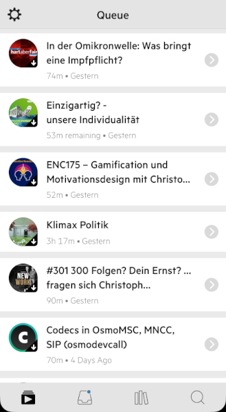

## Wähle eine Podcast App und finde Podcasts (Kata)

**Schritt 1: Wähle eine Podcast App**

Schaue auf deinem Smartphone, ob bereits eine Podcast-App (auch Podcatcher) vorhanden ist. Wenn nicht, gehe in den App Store deines Betriebssystems und installiere die Podcast App deiner Wahl.

Oft verwendete Podcatcher sind:

- Antenna Pod (Android)

- Castro (iOS)

- Downcast (iOS, Mac)

- Pocket Casts (Android, iOS)

- Podcasts (iOS)

- Podcat (iOS)

**Schritt 2: Höre Podcasts und suche nach Vorbildern für deinen Podcast**

Suche in deiner Podcast App, in Suchmaschinen oder anderen Plattformen nach Podcasts, die für deine Ziele, Wissensgebiete, Aufgaben und Projekt relevant sind. Abonniere mindestens fünf Podcasts und höre sie in deinem Alltag. Achte auf Beispiele, die dir für einen eigenen Podcast gefallen würden.
