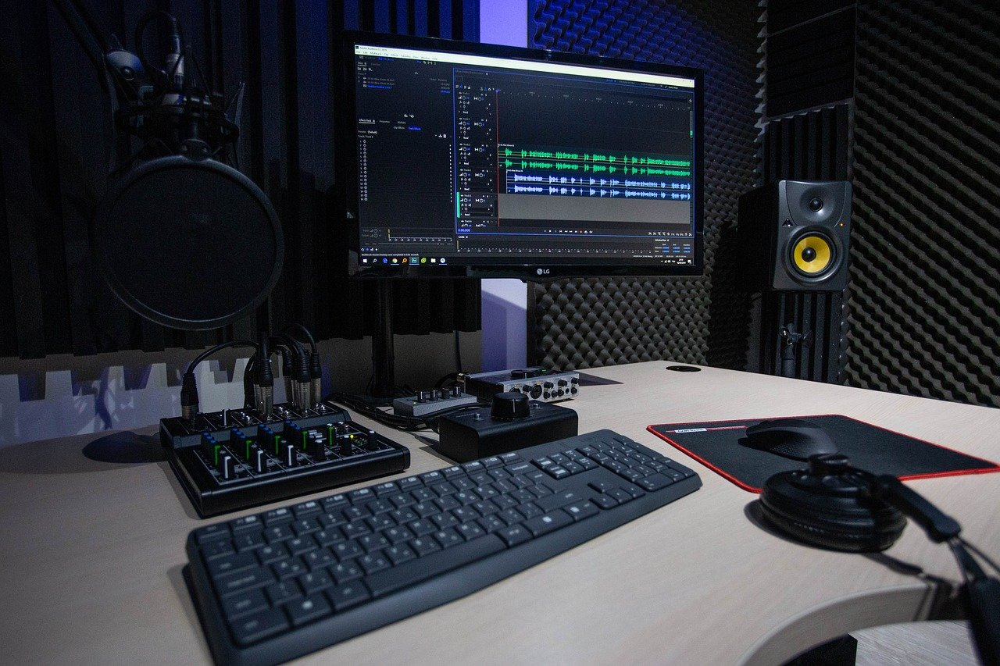

## Dein Podcast-Studio (Kata)

**Schritt 1: Wähle dein(e) Podcast-Studio(s)**

Wahrscheinlich hast du keinen Raum, der nur als Podcast-Studio verwendet wird. Trotzdem solltest du etwas Zeit darauf verwenden, den Raum und die Umgebung, die du für Aufnahmen verwendest, so optimal wie möglich zu gestalten. Vielleicht hast du auch mehrere Orte, an denen du aufnehmen möchtest (z.B. zu Hause, im Homeoffice, im Büro, in Besprechungsräumen, unterwegs z.B. auf Veranstaltungen oder Konferenzen)?

Je Aufnahmeort solltest du dir überlegen, was du für eine möglichst gute Aufnahme beachten musst, z.B.

- Positionen der Podcastenden

- Vermeidung Raumhall (z.B. Dämmung, Vermeidung von glatten Flächen)

- Störgeräusche

- Standard-Setup Hardware

- Standard-Setup Software

- Verkabelung

- Bei mobilem Einsatz: Transportbehälter, um Schäden und Verlust zu vermeiden

**Schritt 2: Podasting-Ausrüstung ausprobieren**

Verwende etwas Zeit, dich mit Hardware und Software vertraut zu machen. Im Lauf deiner Podcast-Karriere wird sich dein Studio durch deine Erfahrungen kontinuierlich verbessern.

**Tipp:** wenn du Remote-Podcast mit Menschen machst, die keine gute Audio-Ausstattung haben, lohnt es sich, ein kleines Podcasting-Set zum Verschicken zu haben (z.B. Focusrite Scarlett Solo + Beyerdynamic DT 297).
