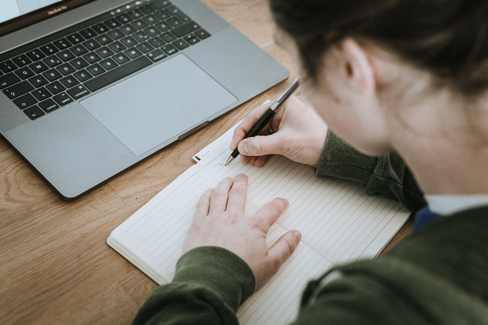
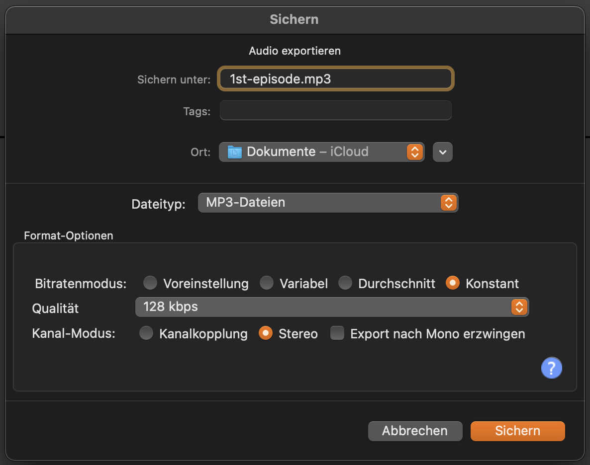

## Achtung Aufnahme Episode 1 (Kata)

**Schritt 1: Plane deine erste Episode**

Die grobe Struktur deiner Podcast-Episoden hast du dir ja schon in dem Podcasting Canvas überlegt. Jetzt geht es an die Feinplanung der ersten Episode:

1. Bist du alleine oder hast du andere Personen im Podcast?

2. Nimmst du vor Ort auf oder sind Personen remote? (Technik-Check machen!)

3. Welche Themen werden im Podcast behandelt? Welche Fragen willst du stellen? Erstelle mindestens einen "roten Faden" mit Stichpunkten zu den Themen der Episode.

4. Was musst du für die Episode recherchieren? Welche Hintergrundinformationen brauchst du noch?

5. Wo dokumentierst du die Episoden-Planung? Um den Aufwand gering zu halten, kannst du den roten Faden gleich so dokumentieren, dass du ihn für die Shownotes verwenden kannst.

**Tipp:** im Internet kannst du z.B. Google Docs oder Etherpads zur Planung von Episoden verwenden. Im Intranet geht das z.B. mit OneNote, Word, Wikis oder der Wiki-Funktion in Microsoft Teams.

**Schritt 2: Nimm die erste Episode auf**

Erstelle jetzt die Aufnahme der Episode. Mache so viele Aufnahmen, bis du mit dem Ergebnis zufrieden bist. Wenn man sich versprochen hat, einfach eine kurze Pause lassen und neu aufsetzen. Beim Schnitt von Audio sind solche Bearbeitungen viel leichter möglich, als bei Video. Einige Dinge solltest du bei der Aufnahme beachten:

- Sind deine Geräte gut mit Stom versorgt (Batterie nur wenn absolut notwendig verwenden)?

- Hast du den Pegel der Aufnahme im Blick, damit die Aufnahme nicht über- oder untersteuert ist.

- Hast du alles getan, um Störgeräusche zu vermeiden (Tür zu, Telefon aus, Fenster zu etc.)?

- Bei Remote-Aufnahmen: ist die Netzwerkverbindung stabil (besser LAN als WLAN verwenden)?

- Hast du eine Backup-Aufnahme zur Sicherheit, falls etwas mit der eigentlichen Aufnahme nicht klappt?

**Schritt 3: Bearbeite und exportiere deine erste Episode**

Die Aufnahme ist im Kasten, jetzt geht es an den Schnitt. Dafür ist es wichtig, die richtige "Schnittstrategie" für dich zu finden:

- Fange von hinten an: wie viel Zeit willst du in den Schnitt investieren?

- Willst du alle Äh's rausschneiden?

- Willst du Musik, Trenner, Bumper, Intro, Outro etc. einfügen?

- Willst du Effekte wie Kompression, Expansion in der Postproduktion verwenden?

- Willst du Shownotes zu deinen Episoden bereitstellen?

- Willst du ein Transkript zu deinen Episoden bereitstellen?

- Willst du Kapitelmarken zum Navigieren in deinem Podast verwenden?

- Willst du Kapitelbilder verwenden?

Wenn die Aufnahme geschnitten ist, exportiere die finale Audio-Datei deiner Episode (in vielen Tools heißt das auch "rendern"). Empfehlung zum Start ist, eine MP3-Datei mit 128kBit/s (Bitrate) in Stereo zu erzeugen. Wenn du Zeit und Lust hast probiere verschiedene Bitraten aus und finde den richtigen Qualitätsstandard für dich.

Wenn die erste Episode fertig ist, lasse andere diese anhören und hole dir Feedback. Dafür brauchst du noch keine Webseite, schicke z.B. einfach einfach einen Link auf die Datei in einem Filesharing-Dienst (z.B. Drobpox, OneDrive).