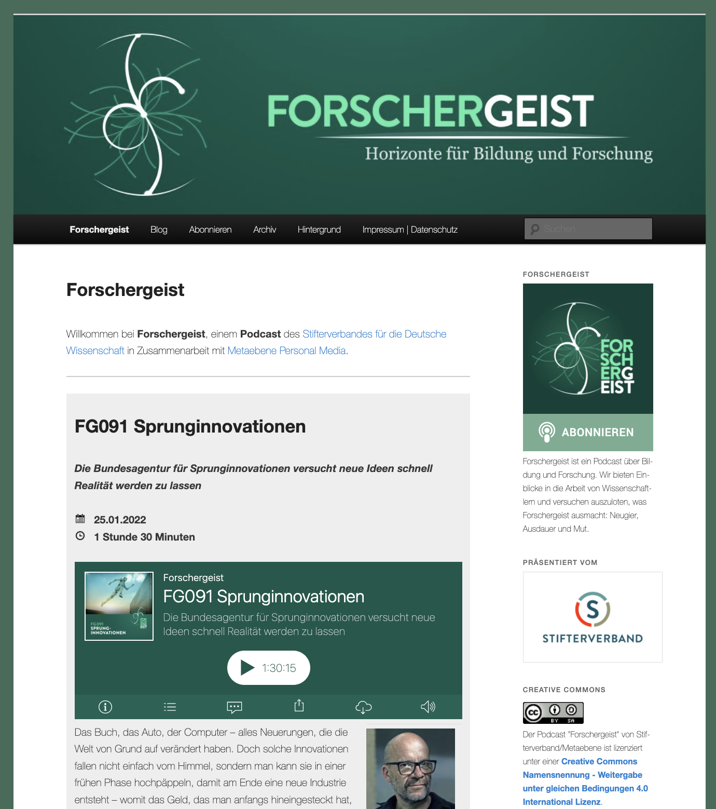

## Deine Podcast-Webseite (Kata)

**Schritt 1: Hole dir Anregungen für deine Podcast-Webseite**
Die meisten Podcasts haben als "Heimat" eine Webseite im Internet oder Intranet, die als Anlaufstelle für neue Hörer_innen dient. Deine Stamm-Hörer_innen werden den Podcast ja abonniert haben und ihn i.d.R. im Podcatcher auf dem Smartphone hören, aber gerade für neue Hörer_innen ist die Webseite wichtig. Schaue dir zunächst Webseiten von deinen Lieblingspodcasts an und überlege, welche Inhalte auf deiner Webseite sein sollen. Ein Beispiel (Forschergeist Podcast):

Typische Elemente einer Podcast-Webseite sind:

- Kopfbereich (Header) mit Logo des Podcasts (meist dem Cover Art ähnlich)

- Kurzbeschreibung des Podcasts

- Hervorhebung der aktuellen Episode und/oder besonders guter Episoden

- Archiv aller Episoden

- Möglichkeit den Podcast zu abonnieren (z.B. Subscribe-Button, RSS-Logo) und meist auch eine Beschreibung dazu (gerade wenn die Zielgruppe nicht gewöhnt ist, mit Podcasts umzugehen)

- Möglichkeiten der Unterstützung des Podcasts (z.B. Mithelfen bei Recherche, Gäste vorschlagen, finanzielle Unterstützung)

- Informationen zu Lizenz (z.B. offene Creative Commons Lizenz) und rechtlichen Rahmenbedingungen (z.B. Impressum, Datenschutz)

- Link zu einer Community-Plattform für Hörer_innen des Podcasts

- und welche Informationen darauf enthalten sein sollen (z.B. Logo, Kurzbeschreibung, aktuelle Episoden und Archiv, Anleitung zum Abonnieren, Link zur Community und Sozialen Medien, Lizenz, Impressum&Rechtliches).

**Schritt 2: Erstelle den ersten Prototyp deiner Podcast-Webseite**i

Überlege dir, wo du die Webseite zu deinem Podcast aufbauen willst. Idealerweise erstellst du den Prototyp schon in der richtigen Software, zur Not reichen aber auch Papier und Bleistift. Wenn du Software verwendest mache dich damit vertraut.

**Tipp:** sprich mit anderen Podcaster_innen, die die die gleiche Software verwenden. Diese können dir meist viele Tipps und bewährte Vorgehensweisen (Good Practices) erzählen.

Typische Plattformen für Podcast-Webseiten im Internet:

- Wordpress z.B. mit [Podlove](https://podlove.org) Podcast Publisher

- Podigee

- Anchor

- Libsyn

- Spotify (eigentlich Audio-on-Demand und kein Podcast, weil es keinen Feed gibt)

Typische Plattformen für Podcast-Webseiten im Intranet:

- SharePoint Communication Site

- Vimp

- Kaltura

- Yammer oder Microsoft Teams für die Community

Zeige anderen den Prototyp deiner Podcast-Webseite und hole dir Feedback.

**Schritt 3: Veröffentliche deine erste Episode**

Veröffentliche jetzt deine erste Podcast-Episode auf deiner Podcast-Webseite. Typische Schritte hierfür sind:

1. Podcast-Episode hochladen (das kann direkt auf der Webseite sein, oder bei einem separaten Podhosting-Dienst wie z.B. Podigee, podcaster.de)

2. Beitrag zur Episode anlegen mit Titel, Text (Shownotes, Links, Infos zu Beteiligten), Schlagwörtern (Kategorien, Hashtags) und Audio-Player (in Wordpress sind das z.B. Beiträge, in SharePoint Neuigkeiten)

3. Podcast-Episode veröffentlichen, fertig :-)
